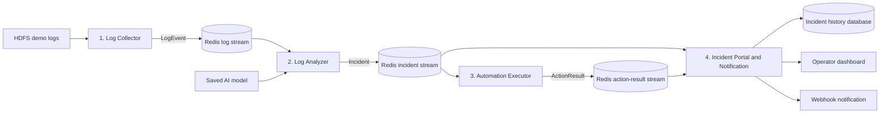

## Automated Incident Triage for Cloud Infrastructure

This is an AI-powered DevOps automation project that helps operators investigate HDFS infrastructure incidents. The system collects server logs, detects unusual block activity, prepares a readable incident summary and selects a safe response from an approved action list.


## Project overview

Large infrastructure systems generate more log messages than an operator can realistically read during an incident. A single failure may be spread across many lines, processes and components, which makes the root cause difficult to find quickly.

This is intended to shorten this first stage of troubleshooting. It replays HDFS logs as if they are arriving from a server, groups related events using their block ID and uses a machine-learning model to decide whether the activity is normal or anomalous.

When an anomaly is found, the system prepares an incident record containing the affected block, model confidence, important events and a recommended response. All mitigation commands are simulated in dry-run mode for safety.

## Problem statement

System administrators and DevOps teams often need to search through very large log files when a service becomes slow, unavailable or unstable. Manual log investigation takes time and may produce inconsistent results, especially when the operator is working under pressure.

This project addresses the problem by automating four parts of the initial incident response:

1. collecting and organising incoming log messages;
2. detecting abnormal behaviour with an AI model;
3. selecting a controlled first-response action; and
4. notifying the operator with a structured summary.

This is relevant to the engineering industry because fast incident detection can reduce service downtime, shorten investigation time and help teams respond more consistently.

## Project objectives

- Build an AI application that detects anomalous HDFS block traces.
- Replay historical HDFS logs to simulate a live infrastructure environment.
- Group related log events by `BlockId` before performing analysis.
- Show the model result together with confidence and supporting events.
- Map recognised incidents to an approved mitigation action.
- Keep all project commands in dry-run mode unless they are explicitly approved.
- Send a structured incident summary to a dashboard and webhook.
- Design the application as four independent microservices.
- Make the architecture modular, scalable and fault tolerant.
- Track team progress and individual contributions through Git.

## Target users

### System administrators

System administrators can use the incident summary to find the relevant HDFS activity without reading the full log file line by line.

### DevOps engineers

DevOps engineers can use the model result and suggested action as a starting point when deciding how to recover an affected service.

### Site Reliability Engineers

Site Reliability Engineers can review the anomaly evidence, severity and action history as part of a repeatable incident-response process.

### Organisations operating distributed infrastructure

Teams running storage clusters, cloud services or other distributed systems can use the project as a proof of concept for AI-assisted operations.

## Expected outcomes

The completed project should provide:

- a functional application that processes HDFS logs from collection to notification;
- an evaluated AI model for normal-versus-anomalous block detection;
- a readable explanation of the events connected to an incident;
- a safe, policy-based response that does not accept unrestricted commands;
- a dashboard or webhook summary that helps an operator make a decision;
- four independently testable application services;
- Docker images for all microservices;
- a Minikube deployment with at least one scaled service; and
- clear documentation that another developer can follow.

The aim is not to replace an operator. The expected result is a decision-support tool that reduces the amount of raw data the operator needs to inspect and provides a consistent starting point for investigation.

## Main features

- HDFS log replay at a configurable speed
- Block-level event grouping
- AI-based anomaly detection
- Confidence score and evidence events
- Human-readable incident categories
- Severity and action mapping
- Dry-run mitigation commands
- Incident history
- Dashboard and webhook notification
- Independent service deployment

## Dataset

This project uses the [LogHub HDFS_v1 dataset](https://github.com/logpai/loghub/tree/master/HDFS). It contains logs collected from a Hadoop Distributed File System environment and provides normal or anomaly labels for individual HDFS block traces.

### Dataset summary

| Item | Value |
|---|---:|
| Raw log records | 11,175,629 |
| Labelled block traces | 575,061 |
| Normal traces | 558,223 |
| Anomalous traces | 16,838 |
| Event templates | 29 |

### Prepared files

| File | Purpose |
|---|---|
| `HDFS_LOGCOLLECTOR.csv` | Structured raw records that the Log Collector can replay. |
| `preprocessed/AI_TRAINING_DATA.csv` | Ordered event sequences grouped by HDFS block for model training. |
| `preprocessed/anomaly_label.csv` | Official normal or anomaly label for every block ID. |
| `preprocessed/EVENTID_MEANING.csv` | Maps event IDs to readable HDFS event descriptions. |
| `preprocessed/Event_occurrence_matrix.csv` | Event-count features for a comparison model. |
| `preprocessed/HDFS.npz` | Optional numerical features supplied with the dataset. |

The full dataset is too large for GitHub and should not be committed to the repository. Preparation instructions and scripts should be committed instead, while local data stays in an ignored data folder.

### How the dataset is used

The dataset has two roles:

**Model development**

```text
AI_TRAINING_DATA.csv + anomaly_label.csv
        -> clean event sequences
        -> split unique block IDs
        -> extract features
        -> train and validate model
        -> save selected model
```

**Application demonstration**

```text
HDFS_LOGCOLLECTOR.csv
        -> select complete demo block traces
        -> replay messages in original order
        -> send events to Log Analyzer
```

Training, validation and test data will be split by `BlockId`. This prevents events from the same HDFS block from appearing in more than one split.

## AI approach

The core AI task is block-level anomaly detection. The model receives an ordered sequence of HDFS event IDs belonging to one block and predicts whether that trace is normal or anomalous.

The initial baseline uses:

- TF-IDF features from event sequences;
- unigram and bigram event patterns; and
- class-weighted Logistic Regression.

A second approach using the event-occurrence matrix will be compared with the sequence baseline. The final model will be selected using validation results rather than accuracy alone.

The evaluation will report:

- precision;
- recall;
- F1 score;
- PR-AUC; and
- confusion matrix.

Recall is important because a missed anomaly may leave an infrastructure problem undetected. Precision is also monitored so that operators are not overwhelmed by false alerts.

## Initial system architecture



Redis and the incident-history database are supporting infrastructure. The four numbered components are the application microservices.

### End-to-end flow

1. The Log Collector reads selected HDFS messages in their original order.
2. Each message is published as a versioned `LogEvent`.
3. The Log Analyzer groups events by block ID and applies the saved model.
4. An anomalous trace produces a structured `Incident`.
5. The Automation Executor checks the incident against the action policy.
6. The executor returns an `ActionResult` containing the simulated command and status.
7. The Incident Portal combines the analysis and action result.
8. The completed incident is stored, displayed and sent to a webhook.

## Planned microservices

### 1. Log Collector

The Log Collector simulates a live server by reading a smaller HDFS demo file one row at a time.

Main responsibilities:

- preserve the original log order;
- apply a configurable replay delay;
- validate required fields;
- publish `LogEvent` messages; and
- retry temporary connection failures.

### 2. Log Analyzer

The Log Analyzer contains the core AI functionality.

Main responsibilities:

- consume log events;
- group events using `BlockId`;
- load the saved preprocessing and model pipeline;
- predict normal or anomalous behaviour;
- identify useful evidence events; and
- publish a structured incident.

### 3. Automation Executor

The Automation Executor converts an approved incident category into a safe, simulated response.

Main responsibilities:

- apply confidence and severity rules;
- select actions from an allow-list;
- reject unknown or unrestricted commands;
- prevent the same incident from triggering twice; and
- record every action in dry-run mode.

Example:

```text
DRY RUN: kubectl rollout restart deployment/hdfs-datanode
```

### 4. Incident Portal and Notification

The Incident Portal provides the user-facing part of the application.

Main responsibilities:

- combine the incident with its action result;
- store incident and action history;
- display current and previous incidents;
- translate event IDs into readable descriptions; and
- send a structured webhook notification.

## Example service messages

### Log event

```json
{
  "schema_version": "1.0",
  "line_id": 125,
  "timestamp": "2008-11-09T20:35:18",
  "level": "INFO",
  "component": "DataNode",
  "block_id": "blk_-123456",
  "message": "Receiving block..."
}
```

### Incident

```json
{
  "schema_version": "1.0",
  "incident_id": "inc-001",
  "block_id": "blk_-123456",
  "prediction": "anomaly",
  "anomaly_probability": 0.94,
  "category": "network_transfer_failure",
  "severity": "high",
  "evidence_event_ids": ["E17", "E29"],
  "recommended_action": "restart_datanode",
  "model_version": "hdfs-model-1.0"
}
```

## Automation policy

The model does not generate shell commands. It returns an incident result, and the executor selects an action from a reviewed policy.

| Incident category | Simulated action | Safety behaviour |
|---|---|---|
| Network transfer failure | Restart a DataNode deployment | Requires sufficient confidence and cooldown check |
| Storage block failure | Run an HDFS block-health check | Diagnostic action only |
| Metadata failure | Run a NameNode health check | Notify operator before any restart |
| Replication timeout | Restart or scale a worker | Apply retry and replica limits |
| Unknown incident | Notify operator only | No command allowed |

## Architecture qualities

### Modularity

Each microservice has one main responsibility and exchanges versioned JSON messages. The AI model can be changed without rewriting the Log Collector or Automation Executor. The action policy can also be changed without retraining the model.

### Scalability

The Log Analyzer performs the most processing, so it is the first service planned for horizontal scaling. Multiple Analyzer replicas can join the same Redis consumer group and divide incoming block traces between them.

### Fault tolerance

The planned design includes:

- message acknowledgement before completed items are removed;
- bounded retries for temporary failures;
- a dead-letter stream for messages that repeatedly fail;
- unique incident and action IDs to prevent duplicate processing;
- webhook retry with backoff;
- health and readiness endpoints; and
- notification-only behaviour for unknown or low-confidence incidents.

### Maintainability

Shared message schemas will be stored under `contracts/`. Configuration such as replay speed, model path and service URLs will be supplied through environment variables rather than being hard-coded.

## Planned technology stack

| Area | Technology |
|---|---|
| Language | Python |
| API services | FastAPI |
| Dashboard | Streamlit |
| AI development | pandas and scikit-learn |
| Message communication | Redis Streams |
| Incident storage | PostgreSQL or SQLite for the first local version |
| Containerisation | Docker and Docker Compose |
| Orchestration | Kubernetes with Minikube |
| Version control | Git and GitHub |

## Planned repository structure

```text
.
|-- README.md
|-- requirements.txt
|-- .env.example
|-- contracts/
|   |-- log_event.schema.json
|   |-- incident.schema.json
|   `-- action_result.schema.json
|-- data/
|   |-- README.md
|   |-- raw/                  # ignored by Git
|   `-- demo/
|-- ml/
|   |-- train_model.py
|   `-- evaluate_model.py
|-- models/                  # generated files, normally ignored
|-- services/
|   |-- collector/
|   |-- analyzer/
|   |-- executor/
|   `-- portal/
|-- tests/
|-- k8s/
`-- docker-compose.yml
```

## Local development

The following is the intended local setup. Commands will be checked and updated when the service code is added.

### 1. Clone the repository

```bash
git clone <repository-url>
cd <repository-folder>
```

### 2. Create the environment file

```bash
cp .env.example .env
```

Windows PowerShell:

```powershell
Copy-Item .env.example .env
```

### 3. Add the dataset

Download HDFS_v1 from LogHub and place the required prepared files under the local data directory. Do not commit the full dataset or ZIP archive.

### 4. Install development dependencies

```bash
python -m venv .venv
```

Windows PowerShell:

```powershell
.venv\Scripts\Activate.ps1
python -m pip install -r requirements.txt
```

### 5. Start the complete local application

Once the Dockerfiles and Compose file are implemented:

```bash
docker compose up --build
```

## Docker deployment

Each application microservice will have its own Dockerfile and will be tested independently before integration.

Planned image names:

| Service | Image |
|---|---|
| Log Collector | `<dockerhub-user>/logsentinel-collector:<version>` |
| Log Analyzer | `<dockerhub-user>/logsentinel-analyzer:<version>` |
| Automation Executor | `<dockerhub-user>/logsentinel-executor:<version>` |
| Incident Portal | `<dockerhub-user>/logsentinel-portal:<version>` |

Example build:

```bash
docker build -t <dockerhub-user>/logsentinel-analyzer:latest services/analyzer
```

Example isolated run:

```bash
docker run --rm <dockerhub-user>/logsentinel-analyzer:latest
```

Public registry links and verified commands will replace the placeholders after the images have been tested and pushed.

## Kubernetes deployment

The finished application will be deployed to a local Minikube cluster.

```bash
minikube start
kubectl apply -f k8s/
kubectl get pods
kubectl get services
```

The Log Analyzer will be used for the required scaling demonstration:

```bash
kubectl scale deployment log-analyzer --replicas=3
kubectl get pods
```

Deployment will be considered complete only when all pods are healthy, the services communicate correctly and one full incident can pass through the system.

## Development milestones

| Week | Planned result |
|---|---|
| Week 14 | Confirm problem, objectives, target users, expected outcomes, dataset and Git repository |
| Week 15 | Complete the initial architecture and develop the core AI functionality |
| Week 16 | Implement communicating microservices and verify each Docker container locally |
| Week 17 | Complete all services, deploy to Minikube and scale the Log Analyzer |
| Week 18 | Finalise documentation, contribution report, slides and submission files |
| Week 19 | Present the project, live demo and member-owned code walkthrough |

## Current progress

| Item | Status |
|---|---|
| Problem statement and industry relevance | Complete |
| Objectives, target users and outcomes | Complete |
| Dataset selection and preparation | Complete |
| Initial microservices architecture | Complete |
| AI baseline and evaluation | In progress |
| Microservice implementation | Planned |
| Docker images | Planned |
| Minikube deployment and scaling | Planned |

## Team contribution

Replace the placeholders once the team confirms its final ownership.

| Team member | GitHub username | Main responsibility | Owned service/component |
|---|---|---|---|
| Member 1 | `@username` | Data preparation and collection | Log Collector |
| Member 2 | `@username` | Model development and inference | Log Analyzer |
| Member 3 | `@username` | Automation rules and safety | Automation Executor |
| Member 4 | `@username` | Dashboard, notification and deployment | Incident Portal |

For a three-person team, the Log Collector owner can also manage the Incident Portal. Every member should still own meaningful code and be able to explain their commits and implementation.

## Version control

Git is used to track project work. Group members should use short feature branches and clear commit messages.

Examples:

```text
feat(collector): replay HDFS demo logs
feat(analyzer): add anomaly prediction
feat(executor): enforce dry-run action policy
feat(portal): display incident history
test(analyzer): cover malformed event input
docs: update Minikube instructions
```

Large datasets, generated models, `.env` files, passwords and webhook secrets must not be committed.

## Known issues and limitations

- HDFS_v1 represents a historical distributed-storage environment rather than every modern cloud platform.
- The official ground truth is normal or anomaly at block level. Detailed incident categories require separately reviewed rules or annotations.
- The anomaly class is much smaller than the normal class, so model selection must consider recall, precision and class imbalance.
- Log replay simulates streaming data and is not a production log agent.
- All mitigation commands are dry-run actions for the project.
- A production version would require authentication, role-based access, approval workflows, rollback and stricter audit controls.
- The deployment target is Minikube rather than a production cloud cluster.

## Future improvements

- Connect the Collector to a real log source.
- Add authenticated users and role-based access.
- Add approval and rollback workflows for higher-risk actions.
- Compare sequence-aware deep-learning models.
- Add monitoring for model drift.
- Support other infrastructure datasets and cloud platforms.
- Deploy the application to a managed Kubernetes environment.

## References

- LogPAI, [LogHub repository](https://github.com/logpai/loghub)
- LogPAI, [HDFS_v1 dataset](https://github.com/logpai/loghub/tree/master/HDFS)
- J. Zhu et al., [Loghub: A Large Collection of System Log Datasets for AI-driven Log Analytics](https://arxiv.org/abs/2008.06448), ISSRE 2023
- W. Xu et al., [Detecting Large-Scale System Problems by Mining Console Logs](https://people.eecs.berkeley.edu/~jordan/papers/xu-etal-sosp09.pdf), SOSP 2009

## Licence

This repository is currently intended for academic use. A project licence will be added before wider public distribution.
