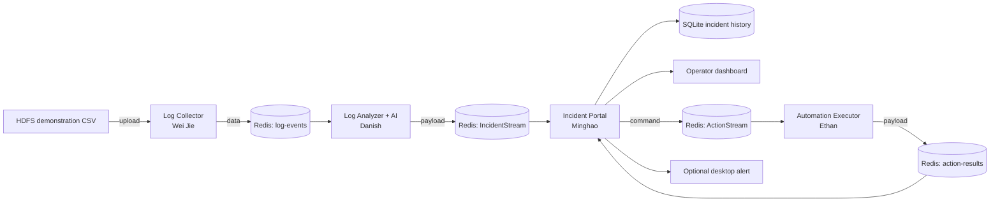

# LogSentinel: Automated Incident Triage for HDFS

LogSentinel is an AI-assisted DevOps prototype that turns HDFS log records into useful incident reports. It collects and validates log data, groups related events by HDFS block, detects anomalous event sequences with a trained machine-learning model, recommends a safe dry-run response, and displays the result in an operator dashboard.

The purpose of the system is to reduce the time an operator spends reading thousands of raw log lines. It supports the operator's decision; it does not replace the operator or execute unrestricted commands.

## Project status

The four main microservices, Redis integration, Dockerfiles, Kubernetes manifests, saved AI model and Incident Portal have been implemented.

| Area | Current implementation |
|---|---|
| Log collection | CSV upload, validation, event mapping and Redis publishing |
| AI analysis | TF-IDF and class-weighted Logistic Regression |
| Automation | Approved action simulation in dry-run mode |
| Incident management | React dashboard, FastAPI API and SQLite history |
| Communication | Redis Streams |
| Containerisation | One Dockerfile for each microservice |
| Orchestration | Minikube/Kubernetes manifests and Analyzer HPA |
| Notifications | Optional Windows desktop notification receiver |

## Simple explanation

The project works like a small incident-response team:

1. The **Log Collector** reads and checks the HDFS log records.
2. The **Log Analyzer** uses the AI model to decide whether each completed block trace is normal or anomalous.
3. The **Incident Portal** saves an anomaly, shows it to the operator and requests a suitable dry-run action.
4. The **Automation Executor** simulates the action and reports the result to the Portal.

Redis Streams acts as the shared message channel. Each microservice runs independently and does not need to import another member's source code.

## System architecture



### End-to-end workflow

1. A user uploads `data/demonstration_traces.csv` to the Collector's `/ingest` endpoint.
2. The Collector validates every row. Invalid rows are sent to `log-events-dead-letter`.
3. Valid messages are mapped to HDFS event IDs such as `E4` and published to `log-events`.
4. The Analyzer buffers event IDs by `block_id` until `trace_complete` is true.
5. The saved TF-IDF vectorizer converts the event sequence into numerical features.
6. Logistic Regression predicts whether the trace is normal or anomalous.
7. Normal traces are logged and require no response. Anomalies are published to `IncidentStream` with a confidence score and evidence.
8. The Portal converts the Analyzer message into its validated incident format, stores it in SQLite and displays it on the dashboard.
9. The Portal maps the incident category to an approved action and publishes the request to `ActionStream`.
10. The Executor simulates the action in dry-run mode and publishes an `ActionResult` to `action-results`.
11. The Portal joins the result to the original incident using `incident_id`. The operator can inspect and acknowledge the completed record.

## Team responsibilities

| Team member | Owned microservice | Main work completed |
|---|---|---|
| **Minghao** | Incident Portal | FastAPI backend, SQLite storage, React dashboard, Redis consumers, Analyzer adapter, Executor request publishing, incident acknowledgement and optional desktop alerts |
| **Danish** | Log Analyzer and AI model | Block buffering, TF-IDF preprocessing, Logistic Regression training/inference, confidence scoring, evidence reporting and anomaly publishing |
| **Wei Jie** | Log Collector | File-upload API, record validation, HDFS event-template mapping, configurable replay, retry handling and dead-letter publishing |
| **Ethan** | Automation Executor | Action request consumer, dry-run response simulation and action-result publishing back to the Portal |

## Implemented microservices

### 1. Log Collector

The Collector is a Flask service on port `8080`. It accepts an HDFS CSV upload instead of relying on a hard-coded local file.

Main functions:

- exposes `/health`, `/ready`, `/ingest` and `/ingest/status/<job_id>`;
- validates required fields, timestamps, log levels and block IDs;
- maps raw HDFS messages to event-template IDs using `data/EVENTID_MEANING.csv`;
- marks the final record for each block with `trace_complete`;
- publishes valid records to Redis with retry handling; and
- keeps invalid records in a dead-letter stream for checking.

### 2. Log Analyzer and AI model

The Analyzer listens to the Collector's `log-events` stream. It groups event IDs by block, loads the saved vectorizer and model, and performs inference when a block trace is complete.

Main functions:

- consumes `block_id`, `event_id` and `trace_complete`;
- reconstructs an ordered event sequence for each block;
- transforms the sequence with the saved TF-IDF vectorizer;
- predicts normal or anomaly with Logistic Regression using the configured anomaly threshold;
- reports anomaly confidence, severity, event count and evidence; and
- publishes anomalies to `IncidentStream`.

### 3. Incident Portal

The Portal is the control and presentation layer. Its FastAPI backend receives live Redis messages and serves the built React dashboard on port `8000`.

Main functions:

- validates and normalises Danish's Analyzer output;
- maps evidence events to readable incident categories and recommended actions;
- stores incidents, action requests, action results, acknowledgements and notification attempts in SQLite;
- prevents duplicate incident and action processing;
- provides overview, incident history, activity and system-status pages;
- lets the operator search, filter, inspect and acknowledge incidents;
- sends action requests to Ethan's Executor; and
- can call a local Windows notification receiver for new incidents.

More Portal-specific details are available in [`services/portal/PORTAL_README.md`](services/portal/PORTAL_README.md).

### 4. Automation Executor

The Executor listens for approved requests from the Portal. It does not accept an AI-generated shell command and does not make a real infrastructure change.

Main functions:

- consumes `incident_id` and `action` from `ActionStream`;
- simulates the response steps in dry-run mode;
- creates a versioned action result with a unique ID and timestamp; and
- publishes the result to `action-results` for the Portal to store and display.

## Redis message contracts

| Stage | Stream | Redis field | Important data |
|---|---|---|---|
| Collector to Analyzer | `log-events` | `data` | `block_id`, `event_id`, `trace_complete` |
| Analyzer to Portal | `IncidentStream` | `payload` | `incident_id`, `block_id`, `confidence_score`, `severity`, `evidence` |
| Portal to Executor | `ActionStream` | `command` | `incident_id`, `action` |
| Executor to Portal | `action-results` | `payload` | `action_result_id`, `incident_id`, `action`, `mode`, `status`, `reason` |
| Invalid Collector input | `log-events-dead-letter` | record fields | original row and validation reason |
| Invalid Portal input | `portal-dead-letter` | record fields | source stream, source ID, error and payload |

The same `incident_id` links the AI prediction, Portal record, action request and returned Executor result.

## Dataset and AI approach

The project is based on the [LogHub HDFS_v1 dataset](https://github.com/logpai/loghub/tree/master/HDFS), which contains HDFS log traces labelled as normal or anomalous at block level.

The complete dataset is not committed because it is very large. The repository contains only the demonstration data and event mapping needed for the live application:

| Repository file | Purpose |
|---|---|
| `data/demonstration_traces.csv` | Small set of HDFS traces used for the integrated demonstration |
| `data/EVENTID_MEANING.csv` | Maps raw HDFS message templates to event IDs |
| `log-analyser/models/tfidf_vectorizer.pkl` | Saved feature transformer used during inference |
| `log-analyser/models/logistic_regression_model.pkl` | Saved trained anomaly classifier |

### Model training used by the current code

1. Load event sequences and labels from `HDFS.npz`.
2. Join every event sequence into a space-separated string.
3. Remove exact duplicate sequences to reduce memorisation leakage.
4. Create stratified training, validation and test partitions in a `70/15/15` ratio.
5. Fit TF-IDF on the training sequences only.
6. Train class-weighted Logistic Regression to handle the smaller anomaly class.
7. Print a validation classification report and save both fitted objects as `.pkl` files.

The running Analyzer uses the saved files; it does not retrain the model whenever the application starts.

For live inference, the current Analyzer uses an anomaly-probability threshold of `0.40`. When a trace crosses that threshold, the Analyzer includes the exact event sequence and event count in its incident message. The Portal uses this information to display supporting evidence and map recognised event IDs to a more specific incident category.

## Technology stack

| Area | Technology |
|---|---|
| Main language | Python |
| Collector API | Flask |
| Portal API | FastAPI and Pydantic |
| Dashboard | React, Vite, GSAP and Phosphor Icons |
| Machine learning | pandas, NumPy and scikit-learn |
| Messaging | Redis Streams |
| Incident storage | SQLite |
| Containers | Docker |
| Orchestration | Kubernetes with Minikube |
| Version control | Git and GitHub |

## Repository structure

```text
.
|-- data/                         # small demonstration data and event mapping
|-- executor/                     # Ethan's Automation Executor
|-- kubernetes/                   # Redis and four-service deployment manifests
|-- log-analyser/                 # Danish's Analyzer, training code and saved model
|-- log-collector/                # Wei Jie's Collector API and ingestion pipeline
|-- services/
|   `-- portal/                   # Minghao's Portal backend, frontend and notifier
|-- prepare_demo.csv.py           # helper for preparing demonstration traces
`-- README.md
```

## Run the complete application with Minikube

This is the recommended full-system demonstration method for the current repository.

### Requirements

- Docker Desktop is installed and running.
- Python is installed for local helper tools.
- `kubectl` and Minikube are installed.
- Ports `8000` and `8080` are available for port forwarding.

### 1. Clone the repository

```powershell
git clone https://github.com/10299hao/EGT307-Project.git
cd EGT307-Project
```

### 2. Start Minikube

```powershell
minikube start --driver=docker
minikube addons enable metrics-server
```

### 3. Build the four application images

Run these commands from the repository root:

```powershell
$portalVersion = Get-Date -Format "yyyy.MM.dd-HHmm"

docker build -t weijiee/log_collector:latest -f .\log-collector\Dockerfile .
docker build -t danish/log-analyzer:evidence-v2 .\log-analyser
docker build -t executor:latest -f .\executor\dockerfile .\executor
docker build --build-arg PORTAL_VERSION=$portalVersion -t "logsentinel-portal:$portalVersion" .\services\portal
```

`$portalVersion` is generated from the build date and time, so the dashboard and image use the same version without editing `App.jsx` manually.

### 4. Load the images into Minikube

```powershell
minikube image load weijiee/log_collector:latest
minikube image load danish/log-analyzer:evidence-v2
minikube image load executor:latest
minikube image load "logsentinel-portal:$portalVersion"
```

### 5. Deploy the application

```powershell
kubectl apply -f .\kubernetes\
kubectl set image deployment/log-analyzer log-analyzer=danish/log-analyzer:evidence-v2
kubectl set image deployment/incident-portal "incident-portal=logsentinel-portal:$portalVersion"
kubectl rollout status deployment/log-analyzer
kubectl rollout status deployment/incident-portal
kubectl get pods
```

All five pods should eventually show `Running`: Redis plus the four application microservices.

### 6. Open the Portal and Collector

Keep each port-forward command running in its own PowerShell window.

Portal window:

```powershell
kubectl port-forward service/incident-portal 8000:8000
```

Collector window:

```powershell
kubectl port-forward service/log-collector 8080:8080
```

Open the dashboard at `http://localhost:8000`. API documentation is available at `http://localhost:8000/docs`.

### 7. Upload the demonstration traces

Open one more PowerShell window in the repository root:

```powershell
curl.exe -X POST http://localhost:8080/ingest -F "file=@.\data\demonstration_traces.csv"
```

The Collector returns a `job_id`. Copy it and check its progress by replacing `<job-id>` below:

```powershell
Invoke-RestMethod "http://localhost:8080/ingest/status/<job-id>"
```

Wait until the job reports `completed`. Refresh the Portal after the job completes. Any traces classified as anomalies should appear as live incidents, followed by their dry-run Executor results.

To verify that a new incident contains real Analyzer evidence:

```powershell
$incidents = Invoke-RestMethod "http://localhost:8000/api/incidents"
$latest = $incidents.items | Sort-Object created_at -Descending | Select-Object -First 1
Invoke-RestMethod "http://localhost:8000/api/incidents/$($latest.incident_id)" | ConvertTo-Json -Depth 8
```

The result should contain a non-empty `evidence_summary`, `evidence_event_ids` and `total_events_analyzed`. Historical incidents created before the evidence fix remain empty and should not be used to verify the updated Analyzer.

### 8. Verify the services during the demonstration

```powershell
kubectl get pods
kubectl get deployments
kubectl get hpa
kubectl logs deployment/log-collector --tail=30
kubectl logs deployment/log-analyzer --tail=30
kubectl logs deployment/executor-app --tail=30
kubectl logs deployment/incident-portal --tail=30
```

### 9. Stop the cluster after the demonstration

```powershell
minikube stop
```

`minikube stop` keeps the cluster for the next run. Use `minikube delete` only when the cluster must be removed and recreated.

## Start an existing deployment again

If the images and Kubernetes resources already exist, they do not need to be rebuilt every time:

```powershell
minikube start --driver=docker
kubectl get pods
```

Then start the two port-forwards in separate PowerShell windows:

```powershell
kubectl port-forward service/incident-portal 8000:8000
```

```powershell
kubectl port-forward service/log-collector 8080:8080
```

If port `8080` is already occupied, first test `http://localhost:8080/health`. A healthy response means an earlier Collector port-forward is already usable. Otherwise, use `kubectl port-forward service/log-collector 8081:8080` and send the upload to port `8081`.

## Update only the Portal UI

A frontend or Portal-backend change requires rebuilding only the Portal image. Use this repeatable PowerShell block so the image tag and displayed Portal version are generated automatically:

```powershell
$portalVersion = Get-Date -Format "yyyy.MM.dd-HHmm"

docker build --build-arg PORTAL_VERSION=$portalVersion -t "logsentinel-portal:$portalVersion" .\services\portal
minikube image load "logsentinel-portal:$portalVersion"
kubectl set image deployment/incident-portal "incident-portal=logsentinel-portal:$portalVersion"
kubectl rollout status deployment/incident-portal
```

The Portal rollout replaces the old pod, so restart its port-forward afterwards and refresh the browser with `Ctrl + F5`. The Collector, Analyzer, Executor and Redis do not need to be rebuilt for a Portal-only change.

## Optional Windows desktop alerts

The notification receiver must run directly on the Windows laptop because a Windows dialog cannot be displayed from inside a Linux container.

First create the Portal backend environment if it does not exist:

```powershell
cd .\services\portal\backend
py -m venv .venv
.\.venv\Scripts\python.exe -m pip install -r requirements.txt
cd ..
```

Start the receiver and keep its PowerShell window open:

```powershell
.\tools\local-notifier\start.ps1
```

Check it locally:

```powershell
Invoke-RestMethod "http://localhost:8090/health"
```

For Minikube, configure the Portal with the special hostname that reaches the Windows host:

```powershell
kubectl set env deployment/incident-portal LOCAL_NOTIFICATION_URL=http://host.minikube.internal:8090/notify
kubectl rollout status deployment/incident-portal
```

Add the same environment variable to `kubernetes/incident_portal_deployment.yaml` to keep it after future `kubectl apply` commands. Notifications are sent only when the Portal stores a genuinely new incident; refreshing the browser does not resend alerts for historical incidents.

## Run only the Incident Portal

This mode is useful for dashboard development when Redis and the teammates' services are unavailable. It uses clearly labelled demonstration records.

```powershell
$portalVersion = Get-Date -Format "yyyy.MM.dd-HHmm"
docker build --build-arg PORTAL_VERSION=$portalVersion -t "logsentinel-portal:$portalVersion" .\services\portal
docker run --rm -p 8000:8000 -e ENABLE_REDIS=false -e SEED_DEMO_DATA=true "logsentinel-portal:$portalVersion"
```

Open `http://localhost:8000`. These records are seeded Portal data, not predictions produced by Danish's running model.

## Useful Portal endpoints

| Endpoint | Purpose |
|---|---|
| `GET /api/health/live` | Confirms that the Portal process is alive |
| `GET /api/health/ready` | Checks the Portal database and Redis readiness |
| `GET /api/service-status` | Shows integration configuration and available dependencies |
| `GET /api/incidents` | Returns searchable incident history |
| `GET /api/incidents/{incident_id}` | Returns one incident and related action/notification details |
| `POST /api/incidents/{incident_id}/acknowledge` | Records the operator acknowledgement |
| `GET /api/stats` | Returns dashboard summary values |
| `POST /api/ingest/incident` | Accepts a test Analyzer incident over HTTP |
| `POST /api/ingest/action-result` | Accepts a test Executor result over HTTP |

## Safety and reliability decisions

- The AI model returns a prediction, not a shell command.
- The Portal maps incidents to a fixed set of known response names.
- The Executor runs only a simulation and labels every result `dry_run`.
- The Collector retries temporary Redis failures and records invalid rows separately.
- The Portal validates incoming messages before writing them to SQLite.
- Duplicate incident/action handling reduces repeated work during message replay.
- Redis consumer groups are used by the Portal so successfully stored messages can be acknowledged.
- Health and readiness probes are included in the Kubernetes manifests.
- SQLite is stored through a Kubernetes persistent-volume claim for the Portal prototype.

## Current limitations

- HDFS_v1 is a historical HDFS dataset; it does not represent every modern cloud platform.
- Log streaming is simulated through CSV upload rather than a production log agent.
- The Analyzer keeps incomplete block buffers in memory, so an Analyzer restart can lose a partial trace.
- The Analyzer HPA manifest demonstrates autoscaling configuration, but Redis consumer-group coordination should be added before relying on multiple Analyzer replicas for production processing.
- Exact duplicate event sequences are separated before training, but stronger split evidence using retained `block_id` values should be added to the model evaluation report.
- The current training script prints validation metrics but does not save the confusion matrix and full test report as repository artifacts.
- SQLite is suitable for one Portal replica in this prototype; a shared database is required for multiple production replicas.
- Authentication, role-based access, approval workflows and rollback are outside the current prototype.
- `services/portal/docker-compose.yml` is not the recommended full-system launcher in this revision because some of its historical wrapper Dockerfile paths were removed. Use the Minikube procedure above for the integrated demonstration.

## Future improvements

- Use Redis consumer groups in the Analyzer for safe horizontal processing.
- Persist partial trace buffers so the Analyzer can recover after restart.
- Save the complete AI evaluation report, confusion matrix and test metrics.
- Add authenticated users, roles and approval rules for higher-risk actions.
- Add retry/cooldown policies and an audit view for automated actions.
- Support live log agents and additional infrastructure datasets.
- Replace SQLite with PostgreSQL for a multi-replica deployment.

## References

- LogPAI, [LogHub repository](https://github.com/logpai/loghub)
- LogPAI, [HDFS_v1 dataset](https://github.com/logpai/loghub/tree/master/HDFS)
- J. Zhu et al., [Loghub: A Large Collection of System Log Datasets for AI-driven Log Analytics](https://arxiv.org/abs/2008.06448), ISSRE 2023
- W. Xu et al., [Detecting Large-Scale System Problems by Mining Console Logs](https://people.eecs.berkeley.edu/~jordan/papers/xu-etal-sosp09.pdf), SOSP 2009
